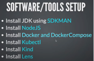
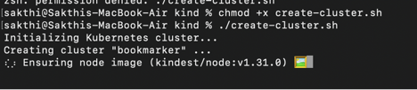

# Bookmarker

### BACKEND
- Build REST API using JAVA 21, SpringBoot, Postgresql, Maven
- Spring Data JPA
- Flyway DB Migration
- Swagger Documentation
- Integration testing using Testcontainers
- GitHub Actions CI/CD

### FRONTEND
- Build UI using ReactJS/NextJS (version 14)
- Bootstrap CSS
- Axios for API communication

### Docker and Kubernetes
- Dockerize the application using Buildpacks and Jib
- Dev environment setup using Docker compose

### Deployment
- Setting up Kubernetes cluster
- Using Lens as K8s GUI   

### Tools


### Workspace setup
#### Install Maven wrapper:
```
mvn wrapper:wrapper
```

#### Maven clean and package:
```
./mvn clean package
```

#### Setup SDKMAN:
 Create a file “.sdkmanrc” with below contents:
```
java=21.0.2-tem
maven=3.9.6
```
This would default to above software versions when we CD into the particular workspace directory. 
SDKMAN! is a tool to manage parallel versions of multiple SDKs, which SDKMAN! call “candidates”.

Refer the source code for below implementations:
* Flyway migration
* Spring Data JPA DTO Projections
* Integration Testing using Test Containers
* Dockerizing backend application
* GitHub Actions
* problem-spring-web 
    ```
  <dependency>
    <groupId>org.zalando</groupId>
    <artifactId>problem-spring-web-starter</artifactId>
    <version>0.29.1</version>
  </dependency>
  
  Response:
  {
    "type": "https://zalando.github.io/problem/constraint-violation",
    "status": 400,
    "violations": [
        {
            "field": "title",
            "message": "Title should not be empty"
        }
    ],
    "title": "Constraint Violation"
  }
    ```
* Docker compose
* Shell script to start/stop application instead of using Docker compose commands directly
   ```
   chmod +x run.sh
  
   ./run.sh start
   ./run.sh stop
   ./run.sh start_infra
   ./run.sh stop_infra
   ./run.sh restart
   ```
* Dockerizing NextJS application
* Kubernetes - Pods, ReplicaSet, Deployment, Service, Ingress 
* Ingress Controller (NGINX)

## How to run?
 Note: Please start Docker desktop in the system

```shell
$ git clone https://github.com/sakthiece08/bookmarker.git
$ cd bookmarker

$ ./run.sh start
$ ./run.sh stop
```
#### To start only infra
```shell
$ ./run.sh start_infra
$ ./run.sh stop_infra
```
## Deployment

* Setting up Kubernetes Kind Cluster. 
  ```
   cd /kind
   chmod +x create-cluster.sh 
   ./create-cluster.sh
  ```


* Deploy app on Kubernetes
  ```
   cd /k8s
   kubectl apply -f . 
  ```
* Install Kubernetes Lens GUI tool - https://k8slens.dev/


### References
  https://axios-http.com/docs/intro
  https://kind.sigs.k8s.io/


