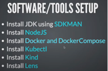

# Bookmarker

### BACKEND
- Build REST API using JAVA 21, SpringBoot, Postgresql, Maven
- Spring Data JPA
- Flyway DB Migration
- Swagger Documentation
- Integration testing using Testcontainers
- GitHub Actions CI/CD

### FRONTEND
- Build UI using ReactJS/NextJS
- Bootstrap CSS
- Axios for API communication

### Docker and Kubernetes
- Dockerize the application using Buildpacks and Jib
- Dev environment setup using Docker compose

### Deployment
- Setting up Kubernetes cluster
- Using Lens as K8s GUI   

### Tools


### Workspace setup
#### Install Maven wrapper:
```
mvn wrapper:wrapper
```

#### Maven clean and package:
```
./mvn clean package
```

#### Setup SDKMAN:
 Create a file “.sdkmanrc” with below contents:
```
java=21.0.2-tem
maven=3.9.6
```
This would default to above software versions when we CD into the particular workspace directory. 

SDKMAN! is a tool to manage parallel versions of multiple SDKs, which SDKMAN! call “candidates”.


